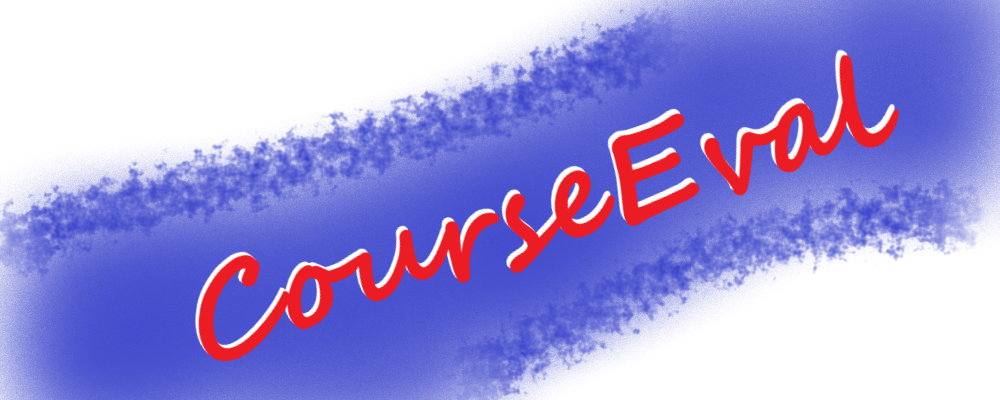

[ cs.drexel.edu](https://www.cs.drexel.edu/)

# 
A student project to learn FOSS contributing practices.

## Contents
- [Contents](#contents)
- [About](#about)
- [Getting Started](#getting-started)
- [Roadmap](#roadmap)
- [Contributing](#contributing)
  - [Guidelines](#guidelines)
  - [Accepting Changes](#accepting-changes)
- [Licensing](#licensing)
- [Contact](#contact)
- [Acknowledgements](#acknowledgements)

## About
A Student Study Project to develop [Course Evaluation](https://en.wikipedia.org/wiki/Course_evaluation) platform prototypes and associated design documents.
By SE420 Open Source Engineering Team Blue for FA22Q2 "Winter" at [Drexel University](https://drexel.edu/).

See the latest discussion (on OneNote, please contact Peter for access) for more detailed information, including proposals.

If you have a security concern, please check the [`SECURITY`](SECURITY.md) for help.

## Getting Started
Please join us on [Discord](https://discord.gg/QKBxxSS9), we are largely focused on *discussing* and *documenting* steps as opposed to outright *programming*.

We currently do a lot of work in *Microsoft Word* and *Markdown*, so having a Microsoft account and a decent text editor is recommendable.

For code-related portions of the project, please consult the [`INSTALL`](INSTALL.md) and the [e-valuation GitHub](https://github.com/e-valuation/EvaP/) for how to run the software.

## Roadmap
(MISSING)

See [**Issues**](https://gitlab.cci.drexel.edu/courseeval/team-blue/-/issues) for more details.

## Contributing

### Guidelines
Please see [`CONTRIBUTING`](CONTRIBUTING.md) and [`CONDUCT`](CONDUCT.md) for specifics.

### Accepting Changes
This is a low-priority project and as such pull requests are not likely to be accepted.
You will be better served by forking it and continuing development of it on your own.

## Licensing
Code is distributed under the MIT license. Documentation is distributed under the CC-BY license. See [`LICENSE`](LICENSE.md) for more information.  

## Contact

### CourseEval
  
  
  

### Peter James Mangelsdorf
  
  
  
  

### Hoang Nguyen
  
  

### Jay Patel
  
  

### Charles Porter
  
  

### Eric Savoy
  
  

### Greg Hislop (Course Instructor)
  

## Acknowledgements
See [`CREDITS.md`](CREDITS.md) for a complete list of external resources.

